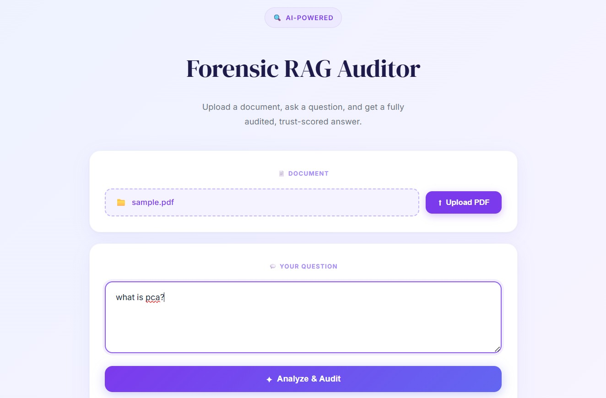
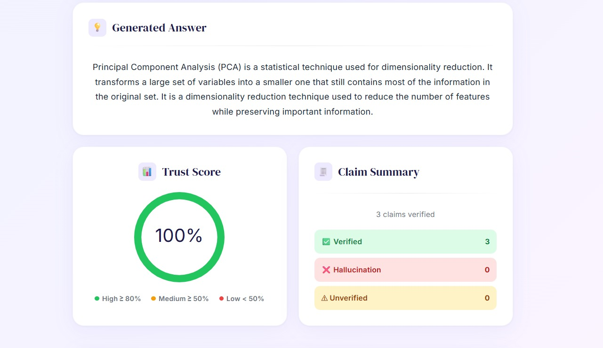
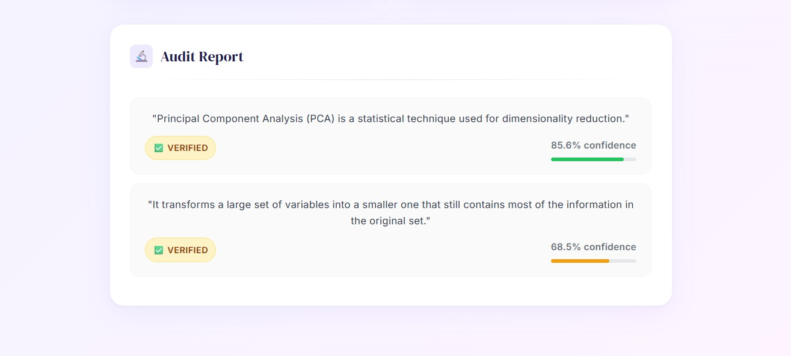

<div align="center">

# 🔍 Forensic RAG Auditor

**Upload a PDF. Ask a question. Get a verified, trust-scored answer.**

A full-stack RAG application that retrieves document context, generates AI answers via Google Gemini, and forensically audits every claim using NLI-based verification.

[](https://python.org)
[](https://fastapi.tiangolo.com)
[](https://react.dev)
[](https://vitejs.dev)
[](https://aistudio.google.com)

</div>

---

## 📸 Screenshots

| Home | Trust Score | Audit Report |
|------|-------------|--------------|
|  |  |  |

---

## ✨ Features

- 📄 **PDF Ingestion** — Upload any PDF; text is extracted and indexed into FAISS for semantic search
- 🤖 **AI Answer Generation** — Google Gemini generates contextual answers grounded in your document
- 🧪 **Claim Verification** — Every sentence in the answer is verified against source context using RoBERTa-MNLI
- 📊 **Trust Scoring** — An overall reliability score (0–100%) is calculated based on verified claims
- 🔬 **Audit Report** — Per-claim breakdown with labels (`✅ VERIFIED`, `⚠ UNVERIFIED`, `❌ HALLUCINATION`) and confidence scores
- ⚡ **Fast Retrieval** — FAISS vector search returns relevant chunks in under 100ms

---

## 🏗️ Architecture

```
User
 │
 ▼
React Frontend (Port 5173)
 │   ├── Upload PDF
 │   ├── Ask Question
 │   └── Display Answer + Audit
 │
 ▼
FastAPI Backend (Port 8000)
 │
 ├── /upload ──► ingest.py ──► PyPDF → Chunk → FAISS Index
 │
 └── /ask
      ├── rag_engine.py  ──► FAISS retrieval (top-k chunks)
      ├── generator.py   ──► Google Gemini → Answer
      └── verifier.py    ──► RoBERTa-MNLI → Claims + Trust Score
```

---

## 📁 Project Structure

```
rag_auditor/
├── backend/
│   ├── main.py            # FastAPI app & endpoints
│   ├── ingest.py          # PDF loading & FAISS indexing
│   ├── rag_engine.py      # Semantic retrieval from FAISS
│   ├── generator.py       # Gemini answer generation
│   ├── verifier.py        # Claim verification & trust scoring
│   ├── documents/         # Uploaded PDF files (auto-created)
│   └── faiss_index/       # Vector index (auto-created)
├── frontend/
│   └── src/
│       ├── App.jsx        # Main React component
│       ├── main.jsx       # Entry point
│       └── index.css      # Global styles
├── requirements.txt
└── README.md
```

---

## 🎥 Demo

### Features Demonstrated

| # | Feature |
|---|---------|
| 1 | 📄 PDF Upload & Indexing |
| 2 | 🔍 Semantic Search with FAISS |
| 3 | 🤖 AI Answer Generation via Gemini |
| 4 | 🧪 Claim-by-Claim Verification (RoBERTa-MNLI) |
| 5 | 📊 Trust Score Calculation (0–100%) |
| 6 | 🔬 Audit Report Visualization |

---

## 🚀 Getting Started

### Prerequisites

| Tool | Version |
|------|---------|
| Python | 3.10+ |
| Node.js | 16+ |
| Google Gemini API Key | [Get one here](https://aistudio.google.com/app/apikeys) |

---

### Backend Setup

```bash
# 1. Clone the repo and navigate to project root
git clone https://github.com/idrees192/forensic-rag-auditor.git
cd rag_auditor

# 2. Create and activate a virtual environment
python -m venv .venv

# Windows
.venv\Scripts\activate

# macOS / Linux
source .venv/bin/activate

# 3. Install dependencies
pip install -r requirements.txt

# 4. Create a .env file in the project root
echo "GEMINI_API_KEY=your_api_key_here" > .env

# 5. Start the backend
cd backend
uvicorn main:app --reload
```

> Backend runs at **http://127.0.0.1:8000**  
> Interactive API docs at **http://127.0.0.1:8000/docs**

---

### Frontend Setup

```bash
# In a new terminal
cd rag_auditor/frontend

# Install dependencies
npm install

# Start the dev server
npm run dev
```

> Frontend runs at **http://localhost:5173**

---

## 🧭 How to Use

### 1. Upload a Document
Click **📁 Choose File**, select a `.pdf`, then click **⬆ Upload PDF**.  
The backend extracts text and builds a FAISS index automatically.

### 2. Ask a Question
Type your question in the textarea and click **✦ Analyze & Audit**.  
The system retrieves relevant chunks, generates an answer, and verifies every claim.

### 3. Review Results

| Section | Description |
|---------|-------------|
| **Generated Answer** | AI response grounded in document content |
| **Trust Score** | 🟢 High ≥ 80% · 🟡 Medium ≥ 50% · 🔴 Low < 50% |
| **Claim Summary** | Count of Verified / Hallucinated / Unverified claims |
| **Audit Report** | Per-claim label, confidence %, and visual bar |

---

## 🔌 API Reference

### `POST /upload`
Upload a PDF to be indexed.

```bash
curl -X POST http://127.0.0.1:8000/upload \
  -F "file=@your_document.pdf"
```

**Response:**
```json
{ "message": "PDF uploaded and indexed successfully." }
```

---

### `POST /ask`
Ask a question against the indexed document.

```bash
curl -X POST http://127.0.0.1:8000/ask \
  -H "Content-Type: application/json" \
  -d '{"question": "What is PCA?"}'
```

**Response:**
```json
{
  "answer": "PCA stands for Principal Component Analysis...",
  "trust_score": 87,
  "audit": [
    {
      "claim": "PCA is a dimensionality reduction technique.",
      "label": "✅ VERIFIED",
      "score": 0.96
    },
    {
      "claim": "PCA was invented in 1995.",
      "label": "❌ HALLUCINATION",
      "score": 0.81
    }
  ]
}
```

---

## ⚙️ Dependencies

### Python
| Package | Purpose |
|---------|---------|
| `fastapi` | REST API framework |
| `uvicorn` | ASGI server |
| `langchain` + `langchain-community` | LLM orchestration & document loaders |
| `pypdf` | PDF text extraction |
| `sentence-transformers` | Semantic embeddings |
| `faiss-cpu` | Vector similarity search |
| `google-generativeai` | Gemini answer generation |
| `transformers` | RoBERTa-MNLI for claim verification |
| `nltk` | Sentence tokenization |

### JavaScript
| Package | Purpose |
|---------|---------|
| `react` | UI framework |
| `axios` | HTTP client |
| `react-circular-progressbar` | Trust score gauge |
| `vite` | Build tool & dev server |

---

## 🛠️ Troubleshooting

<details>
<summary><strong>Backend not responding / 500 errors</strong></summary>

1. Confirm the server is running:
   ```bash
   cd backend && uvicorn main:app --reload
   ```
2. Test the health endpoint:
   ```bash
   curl http://127.0.0.1:8000/
   ```
3. Ensure your virtual environment is activated — look for `(.venv)` in your terminal prompt.

</details>

<details>
<summary><strong>PDF upload fails</strong></summary>

1. Confirm the file is a valid PDF under 50MB.
2. Check that `backend/documents/` was created and the file was saved there.
3. Check that `backend/faiss_index/` was created after upload.

</details>

<details>
<summary><strong>"Cannot find information in document"</strong></summary>

1. Verify the PDF was uploaded:
   ```bash
   ls backend/documents/
   ls backend/faiss_index/
   ```
2. Re-upload the PDF and immediately ask a question.
3. Use direct, simple language that matches terminology in the document.

</details>

<details>
<summary><strong>NLTK tokenizer error</strong></summary>

Run this once manually:
```bash
python -c "import nltk; nltk.download('punkt'); nltk.download('punkt_tab')"
```

</details>

<details>
<summary><strong>Gemini API key error</strong></summary>

1. Ensure your `.env` file exists in the project root with `GEMINI_API_KEY=your_key`.
2. Verify the key is active at [Google AI Studio](https://aistudio.google.com/app/apikeys).
3. Confirm the **Generative Language API** is enabled in your Google Cloud project.

</details>

---

## ⚡ Performance

| Operation | Time |
|-----------|------|
| FAISS vector search | < 100ms |
| First question (NLTK download) | ~10–15 seconds |
| Subsequent questions | ~5–10 seconds |
| Claim verification | Scales with answer length |

---

## 🔒 Security Notes

- **Never commit `.env`** — add it to `.gitignore`
- The `backend/documents/` and `backend/faiss_index/` folders are runtime artifacts — exclude from version control
- For production, add authentication to `/upload` and `/ask` endpoints

---

## 👨‍💻 Author

**Muhammad Idrees**

BS Artificial Intelligence — National University of Sciences and Technology (NUST)

[](https://github.com/idrees192)

---

## 📄 License

This project uses open-source libraries. See individual package licenses for details.

---

<div align="center">

Built with FastAPI · React · Google Gemini · FAISS · RoBERTa

</div>
