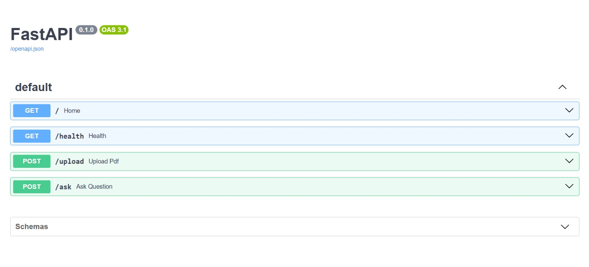

# 📸 Project Screenshots

## Home Page


## PDF Upload & Trust Score


## Audit Report


## FastAPI Backend


# Forensic RAG Auditor

A full-stack RAG (Retrieval-Augmented Generation) application that uploads PDF documents, generates answers from the content, and provides trust scores and claim verification through forensic auditing.

## Project Structure

```
rag_auditor/
├── backend/                    # FastAPI server
│   ├── main.py                # FastAPI app, upload & ask endpoints
│   ├── ingest.py              # PDF loading and FAISS indexing
│   ├── rag_engine.py          # FAISS retrieval with context loading
│   ├── generator.py           # Google Gemini answer generation
│   ├── verifier.py            # Claim verification & trust scoring
│   ├── documents/             # Uploaded PDF files
│   ├── faiss_index/           # Vector search index
│   └── __pycache__/           # Python cache
├── frontend/                   # React + Vite app
│   ├── src/
│   │   ├── App.jsx            # Main React component
│   │   ├── main.jsx           # Entry point
│   │   ├── App.css            # Styles
│   │   └── index.css          # Global styles
│   ├── public/                # Static assets
│   ├── package.json           # Node dependencies
│   ├── vite.config.js         # Vite build config
│   └── index.html             # HTML template
├── requirements.txt           # Python dependencies
└── README.md                  # This file
```

## System Architecture

### Backend (FastAPI - Port 8000)
- **Endpoints:**
  - `GET /` - Health check
  - `POST /upload` - Upload PDF, extract text, build FAISS index
  - `POST /ask` - Retrieve context, generate answer, verify claims, calculate trust

- **Key Modules:**
  - `ingest.py`: Loads PDF using PyPDF, splits into chunks, creates FAISS index
  - `rag_engine.py`: Retrieves relevant document chunks from FAISS
  - `generator.py`: Uses Google Gemini API to generate answers
  - `verifier.py`: Uses RoBERTa-MNLI to verify claims against context

### Frontend (React + Vite - Port 5173)
- Single-page app (SPA) for document upload and Q&A
- Real-time trust score visualization
- Claim-by-claim audit report display

### Data Flow
1. **Upload PDF** → `backend/documents/` + rebuild FAISS index
2. **Ask Question** → Retrieve relevant chunks from FAISS → Generate answer with Gemini → Verify claims → Calculate trust score
3. **Display Results** → Show answer, audit report, and trust metrics

## Setup & Installation

### Prerequisites
- Python 3.10+
- Node.js 16+
- Google Gemini API key

### Backend Setup

1. **Navigate to project root:**
   ```bash
   cd rag_auditor
   ```

2. **Create Python virtual environment:**
   ```bash
   python -m venv .venv
   ```

3. **Activate virtual environment:**
   ```bash
   # Windows
   .venv\Scripts\activate
   
   # macOS/Linux
   source .venv/bin/activate
   ```

4. **Install Python dependencies:**
   ```bash
   pip install -r requirements.txt
   ```

5. **Configure Google Gemini API:**
   - Open `backend/generator.py`
   - Replace the API key:
     ```python
     genai.configure(api_key="YOUR_ACTUAL_API_KEY")
     ```
   - Get your key from: https://aistudio.google.com/app/apikeys

6. **Start the backend server:**
   ```bash
   cd backend
   uvicorn main:app --reload
   ```
   - Backend runs on: `http://127.0.0.1:8000`
   - API docs available at: `http://127.0.0.1:8000/docs`

### Frontend Setup

1. **In a new terminal, navigate to frontend:**
   ```bash
   cd rag_auditor/frontend
   ```

2. **Install Node dependencies:**
   ```bash
   npm install
   ```

3. **Start the Vite dev server:**
   ```bash
   npm run dev
   ```
   - Frontend runs on: `http://localhost:5173`
   - Open in browser and the app auto-reloads on code changes

## How to Use

### 1. Upload a PDF Document
- Click the **"📁 Upload PDF"** button
- Select a `.pdf` file from your computer
- Click **"⬆ Upload PDF"** to process
- The system will extract text and build a searchable FAISS index

### 2. Ask a Question
- Type your question in the **"💬 Your Question"** textarea
- Click **"✦ Analyze & Audit"**
- The system will:
  - Search the uploaded documents for relevant content
  - Generate an answer using Google Gemini
  - Verify each claim in the answer
  - Calculate an overall trust score

### 3. Review Results
- **Generated Answer** - The AI's response based on document content
- **Trust Score** - Percentage score (0-100%) for answer reliability
  - 🟢 **High** ≥ 80% (all claims verified)
  - 🟡 **Medium** ≥ 50% (some claims verified)
  - 🔴 **Low** < 50% (few verified claims)
- **Claim Summary** - Count of verified vs. unverified claims
- **Audit Report** - Detailed breakdown of each claim with confidence scores

## Dependencies

### Python Packages
```
langchain==0.1.16              # LLM framework
langchain-community==0.0.34    # Document loaders & vector stores
pypdf==4.1.0                   # PDF parsing
sentence-transformers==2.6.1   # Embeddings model
faiss-cpu==1.8.0              # Vector search
google-generativeai            # Gemini API
transformers                   # NLP models (RoBERTa)
nltk                          # Text tokenization
fastapi                       # Web framework
uvicorn                       # ASGI server
```

### JavaScript Packages
```
react                         # UI library
axios                         # HTTP client
react-circular-progressbar    # Trust score visualization
vite                         # Build tool
```

## Troubleshooting

### Frontend Not Responding

**Issue:** Browser shows blank page or "Cannot reach server"

**Solutions:**
1. Check if Vite dev server is running:
   ```bash
   cd frontend
   npm run dev
   ```
   Should output: `Local: http://localhost:5173/`

2. Verify frontend is listening on port 5173:
   ```bash
   netstat -ano | findstr :5173  # Windows
   lsof -i :5173                  # macOS/Linux
   ```

3. Clear browser cache (Ctrl+Shift+Delete) and reload

### Backend Not Responding

**Issue:** API calls timeout or return 500 errors

**Solutions:**
1. Check if backend server is running:
   ```bash
   cd backend
   uvicorn main:app --reload
   ```
   Should output: `Uvicorn running on http://127.0.0.1:8000`

2. Test backend health:
   ```bash
   curl http://127.0.0.1:8000/health
   ```
   Should return: `{"status":"healthy","service":"forensic-rag-auditor"}`

3. Check Python virtual environment is activated:
   - Windows: Look for `(.venv)` prefix in terminal
   - If not active, run: `.venv\Scripts\activate`

4. Verify all dependencies installed:
   ```bash
   pip list | grep -E "langchain|faiss|google|transformers"
   ```

### PDF Upload Fails

**Issue:** Upload returns error

**Solutions:**
1. Ensure backend is running (see above)
2. Check file is a valid PDF (< 50MB recommended)
3. Look in `backend/documents/` - file should be saved there
4. Check FAISS index created in `backend/faiss_index/`

### No Results / "Cannot find information in document"

**Issue:** Questions return "I cannot find that information in the document"

**Solutions:**
1. Verify PDF was actually uploaded:
   ```bash
   ls backend/documents/
   ```

2. Check FAISS index exists and is updated:
   ```bash
   ls backend/faiss_index/
   ```

3. The system reloads FAISS on each question, so:
   - Upload a new PDF
   - Ask a question immediately after
   - Verify the question matches content in the PDF

4. Check question clarity:
   - Use simple, direct language
   - Reference terms from the document
   - Example: If PDF is about "machine learning", ask "what is machine learning?" not "tell me everything"

### Google Gemini API Errors

**Issue:** "API key not found" or authentication fails

**Solutions:**
1. Verify API key is set in `backend/generator.py`
2. Get a new key: https://aistudio.google.com/app/apikeys
3. Ensure key has "Generative Language API" enabled
4. Check key hasn't expired or been revoked

### NLTK Model Download Errors

**Issue:** "punkt tokenizer not found" error

**Solutions:**
1. Manually download NLTK data:
   ```bash
   python -c "import nltk; nltk.download('punkt'); nltk.download('punkt_tab')"
   ```

2. These downloads happen automatically on first verification, so first question might be slow

## Running Tests

Basic tests for imports and module structure:
```bash
python test_imports.py
python test_rag.py
python test_retrieval.py
python test_verifier.py
```

## Development

### Backend Changes
- Edit files in `backend/`
- Uvicorn auto-reloads on file save (with `--reload` flag)
- Check terminal for errors

### Frontend Changes
- Edit files in `frontend/src/`
- Vite hot-reloads automatically
- Check browser console for errors (F12)

## API Documentation

After starting the backend, visit: `http://127.0.0.1:8000/docs`

This shows interactive API docs with request/response examples.

### Sample Requests

**Upload PDF:**
```bash
curl -X POST http://127.0.0.1:8000/upload \
  -F "file=@sample.pdf"
```

**Ask Question:**
```bash
curl -X POST http://127.0.0.1:8000/ask \
  -H "Content-Type: application/json" \
  -d '{"question": "What is PCA?"}'
```

## Performance Notes

- First question after upload: ~10-15 seconds (NLTK models download)
- Subsequent questions: ~5-10 seconds (Gemini API call)
- FAISS search: <100ms
- Claim verification: depends on number of sentences in answer

## License

This project uses open-source libraries. Check individual licenses in dependencies.

## Support

- Backend logs: Check terminal where `uvicorn` is running
- Frontend logs: Browser console (F12)
- FAISS index issues: Delete `backend/faiss_index/` folder and re-upload PDF
- Complete reset: Delete `backend/documents/` and `backend/faiss_index/` folders

---

